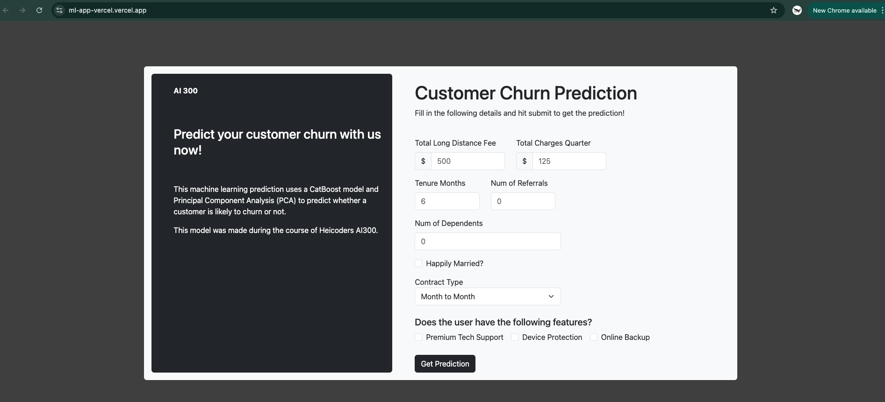
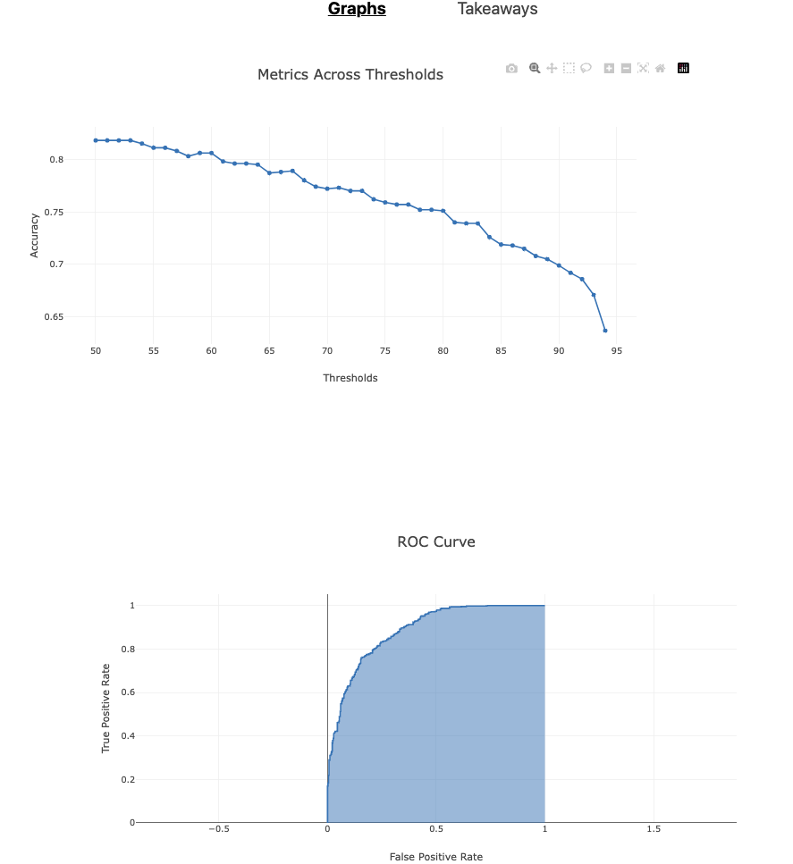

# About
> Note! The link is no longer working correctly as the corrosponding EC2 backend is not live anymore.

This project was built during Heicoder-AI300. During this project, we 
1. Performed EDA, applied PCA, trained an XGBoost model
2. Converted Juypter notebook into Python scripts following OOP principles
3. Pickled model weights, wrote Python Flask server, Docker-ized and deployed on EC2
4. Built and deployed a Vue frontend

Key takeaways from this project are:
* Converting machine learning notebook into a Object-Oriented Programming (OOP) style with Python scripts. This made it easier to swap out models easily in code and not have to rewrite code.
* Building reusable abstract base classes with Python that made swapping out models, preprocessing steps, data sources easier
* Pickling models and preprocessing objects to be used in production
* Dockerizing and deploying an image to AWS EC2
* Learnt how to implement a CI/CD workflow

Beyond the course goals, I decided to use this as an opportunity to practise deploying. During the project itself, I achieved
1. Building and deploying Vue frontend application on Vercel
2. Deploying Python backend on EC2
3. Enabled SSL on EC2 server

Enabling SSL proved to be more difficult than expected, and involved
1. Obtaining a domain name (FreeDNS)
2. Generating a SSL Certificate using Certbot on the Amazon EC2 instance
3. Installing NGINX on the server and configuring it to use 443

This allowed Vercel frontend to receive HTTPS traffic from the backend.

